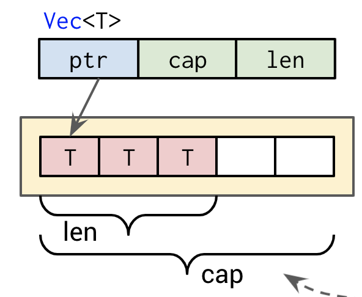

# Rust FFI Basics

## TOC

1. Overview
2. ABI
3. Use Rust from C/C++
4. Use C/C++ code from Rust
5. Types in FFI
6. Ownership and Borrowing

## Overview

* FFI: a way to talk to components compiled to machine code
* Based on platform-dependent C-Application Binary Interface (ABI)

## ABI

* specific to a computing architecture -> low level, hardware dependent
* defines calling conventions for functions
  * describes how arguments are passed (stack/registers)
  * how results are passed back
* and how data is accessed

## Add some rust to your code

```rust
#[no_mangle]
pub extern "C" fn rust_function() {}
```

### #[no_mangle]

The Rust compiler mangles symbol names differently than native code linkers expect. This will tell the compiler *not to be mangle* names.

### extern "C"

By default, any function you write in Rust will use the Rust ABI (which is also not stabilized). Instead, when building outwards facing FFI APIs we need to tell the compiler to use the system ABI.

### On the C side

Every function in your Rust-FFI API needs a corresponding C-declaration.
Our function would then become

```c
extern void rust_function();
```

see `calling rust` example

## Using C code from Rust

see `calling_c` example

## Using a C-library

see `lib_wrapper` example

# The mechanics

## Types

### Easy

* primitive/numeric types
* pointers

### Difficult: Sequences



### Difficult: Structures

Expose rust types to C:

* structs need to be re-structured:

```rust
pub struct Struct {
  v: Vec<u8>,
  id: u8,
}
```

can be used in C/C++ in this form:

```rust
#[repr(C)]
pub struct NativeStruct {
  vec: *const u8,
  vec_len: usize,
  vec_cap: usize,
  id: u8,
}
```

### Borrowing and Ownership

Managing memory is more complicated than in pure rust

```rust
let x = NativeStruct { ... }
```

#### Transform ownership

```rust
// this box has to be freed by hand
let ptr = Box::into_raw(Box::new(x));
```

=> Free memory

```rust
// will be deallocated when out of scope
let _ = Box::from_raw(ptr);
```

#### Borrowing

```rust
// convert rust reference to pointer
let pointer: *const NativeStruct = &x;
```

### Sequences

see `vector` example

